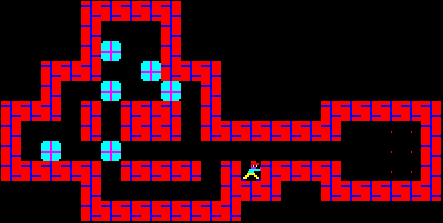

# Sokoban pathfinding

In this optional assignment you will implement a building block to use in the Sokoban project. This is an individual assignment and a self-test of your basic programming skills. Unless you find the task simple you should reconsider the choice of course or brush up on the programming and algorithmic skills that are prerequisites of this course.

A sokoban map is a two-dimensional grid that contains walls, boxes, goals and one player, as seen in the figure /reffig:ex. The target of the game is to push the boxes onto the goals. In this assignment, however, your target is simpler. You just need to move the player to any goal WITHOUT pushing any boxes.



## Input

Your agent program will get as an input a board as a string where each character represents one cell. Each cell will be one of the following symbols:

```
’ ’:	Free space
’#’:	Wall
’.’:	Goal
’@’:	Sokoban player
’+’:	Sokoban player on goal
’$’:	Box
’*’:	Box on goal
```

To be more concrete if "map1.txt" is a file with a sokoban map your agent program "agent" will get map1.txt sent to in on standard input. Under unix/linux this corresponds to running the program like:

```
agent < map1.txt
```

## Output

You should output (on standard output) a string of player movements (composed of a sequence of the characters "U" for up, "D" for down, "L" for left and "R" for right). You must end the string with an end of line. After the moves are executed, the player should stand on a goal. No boxes can be moved!

As an example, if your client receives the board in figure 1, URRRRRRR would be a correct answer. That is, move up one time and then move to the right a bunch of times until you reach the goal locations. We are not requiring your agent to find the shortest solution, so URRLRLRLRRRRRRRDUU would also be correct. If no goal is reachable, the output should be ’no path’ (exactly like that). If the player already is on a goal, the output string may be empty as no moves are needed to reach the goal. For more examples, see below.

Your program must find the path to all maps provided with 1 second.

### Sample 1

Input:
```
########
#   # .#
#   $$.#
####   #
   #@ ##
   ####
```

Output:

```
U R R U
```

### Sample 2

Input:

```
########
#   # .#
#    $*#
####   #
   #@ ##
   ####
```

Output:

```
no path
```

### Sample 3

Input:

```
########
#   # .#
#   $$+#
####   #
   #  ##
   ####
```

Output:

```
```