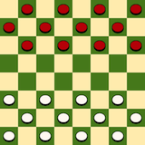

# Checkers
In this problem, you will implement a program that plays the game of checkers (also known as English draughts). Your goal is to implement a strategy that allows your program to win (or not lose) as often as possible. You will be provided a skeleton which generates a list of valid moves for you to choose from (see section 2).

The game of checkers is played by two players, on opposite sides of a squared board. Each player has twelve pieces, which can move diagonally. The goal of the game is to leave your opponent without any movement possibility. This is achieved usually by capturing all of the opponents pieces by jumping over them.

Kattis will give your agent a number of board states and will ask for the best move for each state, at which point you have one second to provide an answer (if you fail to make a move within this time limit, your Kattis submission will generate a Run Time Error and exit with signal SIGXCPU). You will be scored based on these answers. The states are selected in or near the end game and the states represents situations where the answer makes a big difference for the outcome of the game. Note that you are not playing a full game as you would when you play against a friend or yourself.

## Board and pieces
The board is square, containing 8x8 square cells. Cells are alternatively colored white and green, with the lower left corner colored green. Cells connected by a corner share the same color. Only green cells are used in the game.

The game starts with red (or black) pieces in the top three rows, and white pieces in the bottom three rows (see Figure 1). The red player controls the red pieces and the white player controls the white pieces.

The initial board layout can be seen in figure 1.



There are two kinds of pieces: normal pieces, and kings. Initially, all pieces are normal, but any piece that reaches the last row will become a king.

## Valid moves

The players move in turns, alternately. Red player first. In their own turn, a player can move one of their own pieces. All movements are performed diagonally, which means that since all pieces start in green cells, they will always stay in green cells.

Normal pieces can only move forwards (downwards for red pieces, upwards for white pieces). Kings can move in any diagonal direction.

You have one second to make a move.

There are two types of moves:

* **Normal move:** Pieces can be moved diagonally forward, to an adjacent empty square in the next row. Kings can also move backward, to an empty square in the previous row.

* **Jumping:** If the adjacent square in the next row is occupied by an opponent’s piece, and the square immediately and directly opposite that square is empty, the piece can “jump” over the opponent’s piece. Normal pieces can only jump forward, while kings can also jump backward. The piece that is jumped over is captured and removed from the board. It is possible to perform multiple jumps in the same turn, if when the piece lands, there is another immediate piece that can be jumped, even if the jump is in a different direction.

Jumping is mandatory: whenever it is possible to perform a jump, it is not possible to perform a normal move. When more than one jump or multiple jump is available, the player can choose which piece to jump with, and which sequence of jumps to perform. It is not necessary to perform the multiple jump that captures the most pieces. However, it is mandatory to perform all the jumps in the chosen sequence: the moved piece cannot end in a position where another jump would be possible.

If a piece moves into the last row, that piece is “crowned” and becomes a king. The piece that becomes a king after a jump, cannot immediately jump backward over another piece.

## End of game

A player wins by capturing all the opponent’s pieces, or by leaving the opponent with no valid moves. If no pieces are captured for 50 turns (25 of each player), the game is considered a draw.

You can find more information in the [English Wikipedia](https://en.wikipedia.org/wiki/English_draughts), where most of the description provided here comes from.

## Assignment

Your assignment consists of writing a program that plays checkers as one of the players.

However, you are not going to start from scratch. You will receive a skeleton in Java or C++, which will take care of board representation, and calculating the possible moves from each board position. This way, you can focus on implementing the strategy for deciding which is the best move to make, where the core AI lies for this problem.

You should modify the player class and you may also create any number of new classes and files. The files included in the skeleton may be modified locally but keep in mind that they will be overwritten on kattis (except for player.cpp/hpp).

## Java skeleton for checkers dd2380

### Compile

```
$ javac *.java
```

### Run

The players use standard input and output to communicate; this way, a pipe can be created to let agents play with each other.

The Moves are displayed as unicode-art on std err if the parameter verbose is given.

The available modes are:

#### Play against self in same terminal
```
$ mkfifo pipe
$ java Main init verbose < pipe | java Main > pipe
$ java Main init verbose < pipe1 > other_agent/pipe2
```

#### Play against self in two different terminals

Terminal 1:

```
$ mkfifo pipe1 pipe2
$ java Main init verbose < pipe1 > pipe2
```

Terminal 2:
```
$ java Main verbose > pipe1 < pipe2
$ java Main verbose > ../pipe1 < pipe2
```

To play two different agents against each other, you can use the classpath argument:
```
$ java -classpath <path> Main init verbose < pipe | java -classpath <path> Main > pipe
```

The following Players are provided:

* This solution's player at `Player.java`
* A player that chooses moves randomly (which was provided with the skeleton) at `PlayerRandom.java`
* Luis's player at `PlayerLuis.java`
* Armand's player at `PlayerArmand.java`