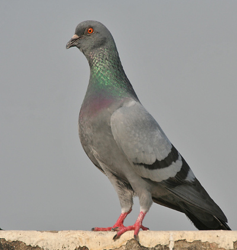
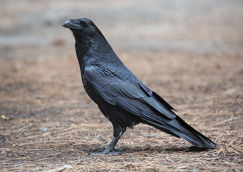
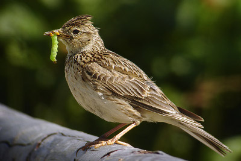
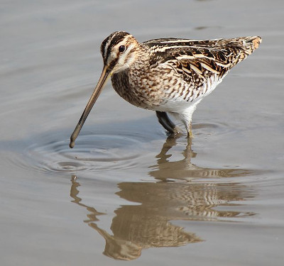
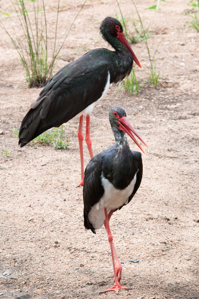

# Duck Hunt

## Game Concept

Though this is a one person version of the game, the game was originally meant for 2-6 players and was designed as a Nintendo TV-video game. The controllers were plastic guns with light sensors that could be aimed at the television to "shoot" the ducks on the TV screen.

This version of Duck Hunt is a generalized version of the original game: There is a sky with birds flying. The birds fly around the sky until they are shot down. The player has to observe the flight patterns of the birds and predict their next move in order to shoot them down. If the prediction is correct, the player will hit the bird and gain one point. If the prediction is wrong the player will miss the bird and lose one point. The game is over when all birds are shot down or when the time runs out.

We have also added different species of birds which behave differently in the air. Most birds give one point when shot, but one of the species is very rare and will hurt your score seriously if you shoot it. The species are identified after each round. In order to prioritize your targets you will need to identify them during flight.

The players may also bet on the species of each bird after each round finishes. The players will get one point for each correct guess and lose one point for each incorrect guess. Guessing is optional, you will choose to guess or not for each bird. The score will be unaffected if no guessing is made. You will get to know the correct species for each bird you make a guess on regardless of whether your guess was correct or not.

## AI Perspective

This version of the game can be broken down into three main, dependent, topics:

* Predicting the flight trajectory of the birds so that they can be shot down.

* Make decisions to shoot or not based on the confidence of prediction of bird species and flight trajectory.

* Identifying the bird species to avoid forbidden targets and maximize score.

Tip: Focus on predicting the movement of a single bird using a HMM. This is the building block to solve the entire homework.

## The Birds

There are 6 species of birds in this version of the game. For the purpose of this game, all species look similar and the player cannot tell the species of any bird by merely looking at the sky at any time. However, the birds behave differently and can thus be distinguished by how they move. The birds and their movement patterns are inspired by birds found in Sweden and their descriptions come mostly from Wikipedia.

### Pigeon



The Rock Dove (Columba livia) or Rock Pigeon is a member of the bird family Columbidae (doves and pigeons). In common usage, this bird is often simply referred to as the "pigeon".

Wild Rock Doves are pale gray with two black bars on each wing, although domestic and feral pigeons are very variable in color and pattern. There are few visible differences between males and females. The species is generally monogamous, with two squeakers (young) per brood. The species is abundant, with an estimated population of 17 to 28 million feral and wild birds in Europe.

Rock Doves have been domesticated for several thousand years, giving rise to the domestic pigeon (Columba livia domestica). As well as food and pets, domesticated pigeons are used as homing pigeons. They were in the past also used as carrier pigeons, and so-called war pigeons have played significant roles during wartime, with many pigeons having received bravery awards and medals for their services in saving hundreds of human lives. There are numerous breeds of fancy pigeons of all sizes, colors and types.

### Raven



The Common Raven (Corvus corax), also known as the Northern Raven, is a large, all-black passerine bird. Found across the northern hemisphere, it is the most widely distributed of all corvids.

The Common Raven averages 63 centimetres (25 inches) in length and 1.2 kilograms (2.6 pounds) in mass. Common Ravens can live up to 21 years in the wild. Young birds may travel in flocks but later mate for life, with each mated pair defending a territory.

Because of its black plumage, croaking call, and diet of carrion, the raven has long been considered a bird of ill omen and of interest to creators of myths and legends. As a carrion bird, ravens are associated with the dead and with lost souls. In Sweden they are known as the ghosts of murdered persons.

### Skylark



The Eurasian Skylark (Alauda arvensis) is a small passerine bird species. This lark breeds across most of Europe and Asia and in the mountains of north Africa. When the word "lark" is used without specification, it usually refers to this species.

The Eurasian Skylark is 16 to 18 centimetres long. It is a bird of open farmland and heath, known throughout its range for the song of the male, which is delivered in hovering flight from heights of 50 to 100 m, when the singing bird may appear as just a dot in the sky from the ground. The song generally lasts two to three minutes, but it tends to last longer later in the mating season. The male has broader wings than the female. This adaptation for more efficient hovering flight may have evolved because of the preference of the female Eurasian Skylark for males that sing and hover for longer periods and so demonstrate that they are likely to have good overall fitness.

Larks, commonly consumed with bones intact, have historically been considered wholesome, delicate, and light game. They can be used in a number of dishes, for example, they can be stewed, broiled, or used as filling in a meat pie. Lark tongues were particularly highly valued. In modern times, shrinking habitats made lark meat rare and hard to come by, though it can still be found in restaurants in Italy and elsewhere in Southern Europe.

### Swallow


The Barn Swallow (Hirundo rustica) is the most widespread species of swallow in the world. It is a distinctive passerine bird with blue upperparts, a long, deeply forked tail and curved, pointed wings.

The swallows and martins have an evolutionarily conservative body shape. Swallows have adapted to hunting insects on the wing by developing a slender, streamlined body and long pointed wings, which allow great maneuverability and endurance, as well as frequent periods of gliding. Their body shape allows for very efficient flight. Swallows usually forage at around 30-40 km/h, although they are capable of reaching speeds of between 50-65 km/h when traveling.

The male Barn Swallow returns to the breeding grounds before the females and selects a nest site, which is then advertised to females with a circling flight and song.

### Snipe



The Common Snipe (Gallinago gallinago) is a small, stocky wader native to the Old World. The breeding habitat is marshes, bogs, tundra and wet meadows throughout northern Europe and northern Asia. It is migratory, with European birds wintering in southern and western Europe and Africa (south to the Equator), and Asian migrants moving to tropical southern Asia. Adults are 25-27 cm in length with a 44-47 cm wingspan and a weight of 80-140 g (up to 180 g pre-migration). They have short greenish-grey legs and a very long (5.5-7 cm) straight dark bill. The body is mottled brown with straw-yellow stripes on top and pale underneath.

The male performs "winnowing" display during courtship, flying high in circles and then taking shallow dives to produce a "drumming" sound by vibrating its tail feathers. Medium speed.

It is a well camouflaged bird, it is usually shy and conceals itself close to ground vegetation and flushes only when approached closely. When flushed, they utter a sharp note that sounds like scape, scape and fly off in a series of aerial zig-zags to confuse predators.

### Black Stork



The Black Stork (Ciconia nigra) is a large wading bird in the stork family Ciconiidae. It is a widespread, but uncommon, species that breeds in the warmer parts of Europe (predominantly in central and eastern regions), across temperate Asia and Southern Africa. This is a shy and wary species, unlike the closely related White Stork. It is seen in pairs or small flocks in marshy areas, rivers or inland waters.

Slightly smaller than the White Stork, the Black Stork is a large bird, 95 to 100 cm (37-39 in) in length with a 145-155 cm (5 ft) wingspan, and weighing around 3 kilograms (6.6 lb). They can stand as tall as 102 cm (40 in). Like all storks, it has long legs, a long neck, and a long, straight, pointed beak. As a broad-winged soaring bird, the Black Stork is assisted by thermals of hot air for long distance flight.

There is currently only one pair of Black Storks in Sweden. **DO NOT SHOOT THEM!**

## Gameplay specifics

The sky is considered flat and the birds can move in the eight basic directions (up, down, left, right, up-left, up-right, down-left, down-right). Some birds can also stop mid-air and hover. They do not have absolute positions as far as you are concerned. Only the direction of the movement is important. Every bird in the sky makes a move for every discrete time step that the game runs. No moves are reported for birds that have been shot.

The birds have different flight patterns. A particular species displays only a few flight patterns and different species may have different variations of them. The patterns may look like this:

* Migrating: The bird will fly mostly in one direction. Different species may migrate in different directions but all birds of the same species will migrate in the same direction in a given environment.

* Circling: The bird gains height by flying up-left or up-right.

* Hunting: The bird dives or flies horizontally back and forth to hunt insects.

* Drilling: To impress on the opposite sex, the bird makes cool tricks in the air. Different species have different drills.

* Zig-zag: This is an erratic flight pattern. The bird flies in different directions to avoid predators.

The goal of the game is to shoot all birds except black storks. The game is divided into several environments with several rounds of shooting. The different environments contains different distributions of birds and the birds may also behave differently in different environment. In particular, the birds will be completely different on Kattis compared to your sample data.

There will be up to 10 rounds in each environment. Each round contains 1-20 birds and goes on for 100 time steps. The round will end when all birds are shot or when time runs out. If you hit a black stork, you can not play any more rounds in that environment and all your points from that environment will be lost. You will still keep your score from the other environments and may continue to the next. The program will be restarted between each environment, so you cannot transfer any information between them.

For more details, please refer to the code inside the provided skeletons.

## Java skeleton for duck hunt dd2380

You should modify the player class and you may also create new classes and files. 

### Input

Your interface with the judge is the player class.

The shoot method of the player class will be called for each time step. The guess method will be called after a round ends. The game state and a deadline are passed as parameters to these functions. The game state contains the birds and their movements so far. The deadline can be used to avoid timeouts.

The guess method of the player class is called after each round. The final game state of a round is passed as a parameter along with a deadline.

The reveal function of the player class is called after guessing, and will reveal the species for the birds you made guesses for.

### Output

The skeleton handles all the output for you. Avoid using stdin and stdout. (Use stderr for debugging.)

### Compile

```
javac *.java
```

### Run

The agent can be run in two different modes:

1. **Server** - act as the judge by sending predefined observations one at a time and asking the client to respond 
2. **Client** - get observations from standard input and output actions to standard output (this is the default mode)

The server and client can be run in separate terminals and communicate through pipes. Create the pipes first. (we recommend cygwin for windows users)

```
$ mkfifo player2server server2player
```

Terminal 1:

```
$ java Main verbose server < player2server > server2player
```

Terminal 2:

```
$ java Main verbose > player2server < server2player
```

Or you may run both instances in the same terminal:

```
$ java Main server < player2server | java Main verbose > player2server
```

You can test a different environment like this

```
$ java Main server load ParadiseEmissions.in < player2server | java Main verbose > player2server
```
